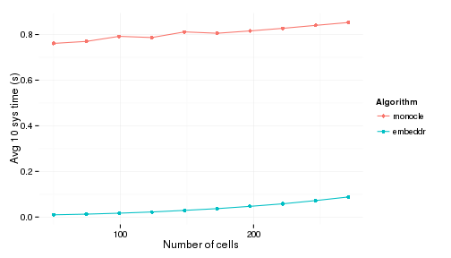
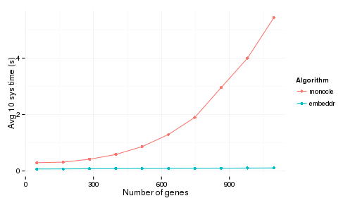

# Compare monocle and embeddr's relative speed
## Kieran Campbell 

First load the data:


```r
set.seed(123)

library(monocle)
library(devtools)
library(gplots)
library(reshape2)

if(!require(scater)) {
  install_github('davismcc/scater')
  library(scater)
}


load_all('/net/isi-scratch/kieran/embeddr/embeddr')


data(HSMM)

load('/net/isi-scratch/kieran/embeddr/embeddr/data/sce_23.Rdata')
sce <- sce_23
sce@lowerDetectionLimit <- log10(0.1 + 1)

min_fpkm <- 1
```

## Dimensionality reduction performance

### Varying number of cells 
Here we randomly subsample cells and look at how the average speed of ten
dimensionality reductions varies for each algorithm. 


```r
sce <- fromCellDataSet(HSMM)
exprs(sce) <- log10(exprs(sce) + 1)
sce@lowerDetectionLimit <- log10(0.1 + 1)
cds <- HSMM

expressed_genes <- rowSums(isExprs(sce)) > 50 # monocle suggested
sce <- sce[expressed_genes,]
cds <- cds[expressed_genes,]

use_for_ordering <- featureNames(cds)[fData(cds)$use_for_ordering]

monocle_time_helper <- function(cds) {
  system.time( replicate(10, cds <- reduceDimension(cds, use_irlba = FALSE)) )[1] / 10
}

embeddr_time_helper <- function(sce) {
  embeddr_rdim_helper <- function(sce) {
    W <- weighted_graph(sce, metric='correlation')
    sce <- laplacian_eigenmap(sce, W)
  }
  system.time( replicate(10, sce <- embeddr_rdim_helper(sce)) )[1] / 10
}

monocle_time_helper(cds)
```

```
## user.self 
##    0.8504
```

```r
embeddr_time_helper(sce[use_for_ordering,])
```

```
## user.self 
##    0.0877
```

```r
set.seed(123)
cells_to_subsample <- seq(from=50, to=dim(sce)[2], length.out=10)

subsample_times <- sapply(cells_to_subsample, function(i) {
  cells <- sample(1:dim(sce)[2], i)
  return( c( monocle_time_helper(cds[,cells]),
             embeddr_time_helper(sce[use_for_ordering, cells])))
})


df_times <- data.frame(n_cells = cells_to_subsample,
                       monocle = subsample_times[1,],
                       embeddr = subsample_times[2, ])

df_melted <- melt(df_times, id.vars = 'n_cells', variable.name='Algorithm', value.name='time')

ggplot(df_melted, aes(x=n_cells, y=time, col=Algorithm)) + 
  geom_line() + geom_point() + theme_minimal() +
  xlab('Number of cells') + ylab('Avg 10 sys time (s)') 
```

 

### Varying number of cells
Here instead we vary the number of cells and see how long the average for 10 dimensionality
reductions takes.


```r
genes_to_subsample <- seq(from = 50, to= round(length(featureNames(sce)) / 10 ), length.out=10)

gene_subsample_times <- sapply(genes_to_subsample, function(i) {
  genes <- sample(featureNames(sce), i)
  cds_tmp <- cds
  cds <- setOrderingFilter(cds, genes)
  c( monocle_time_helper(cds),
     embeddr_time_helper(sce[genes, ]))
})

df_genes <- data.frame(n_genes = genes_to_subsample,
                       monocle = gene_subsample_times[1,],
                       embeddr = gene_subsample_times[2,])

df_melted_genes <- melt(df_genes, id.vars = 'n_genes', variable.name='Algorithm', value.name='time')

ggplot(df_melted_genes, aes(x=n_genes, y=time, col=Algorithm)) + 
  geom_line() + geom_point() + theme_minimal() +
  xlab('Number of genes') + ylab('Avg 10 sys time (s)') 
```

 

## Timing to fit pseudotime 

Here we look at the relative times to fit the pseudotime trajectory. Subsampling of cells would be unfair
to either algorithm so we take a very annecdotal look at it:


### Embeddr


```r
x <- t(log10(exprs(HSMM) + 1))
x_mean <- colMeans(x)
x_var <- apply(x, 2, var)
genes_for_fit <- x_mean > 0.3
CV2 <- x_var[genes_for_fit] / (x_mean[genes_for_fit])^2
df_fit <- data.frame(m = x_mean[genes_for_fit], CV2 = CV2)
fit_loglin <- nls(CV2 ~ a * 10^(-k * m), data = df_fit, start=c(a=5, k=1)) 
ak <- coef(fit_loglin)
f <- function(x) ak[1] * 10^(-ak[2] * x) 
genes_for_embedding <- (CV2 > 4 * predict(fit_loglin))
genes_for_embedding <- names(which(genes_for_embedding))

W <- weighted_graph(sce[genes_for_embedding,])
sce <- laplacian_eigenmap(sce, W)
sce <- cluster_embedding(sce, k=2, method='mm')
system.time(sce <- fit_pseudotime(sce, clusters = 1))
```

```
##    user  system elapsed 
##   0.022   0.001   0.024
```

```r
plot_embedding(sce)
```

```
## Warning in loop_apply(n, do.ply): Removed 112 rows containing missing
## values (geom_path).
```

 

### Monocle


```r
cds <- reduceDimension(HSMM, use_irlba = FALSE)
```

```
## Reducing to independent components
```

```r
system.time(cds <- orderCells(cds, num_paths = 2, reverse = TRUE))
```

```
##    user  system elapsed 
##   4.553   0.001   4.555
```

```r
plot_spanning_tree(cds)
```

 

